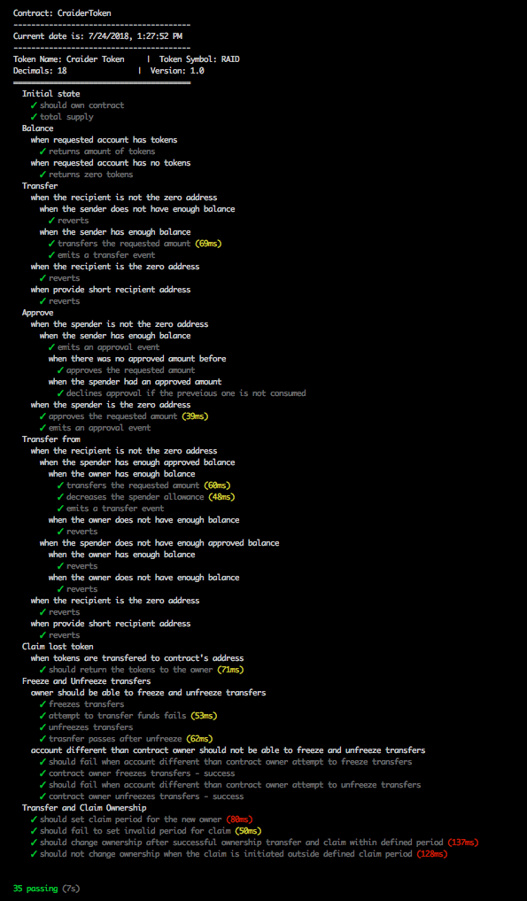

# Craider RAID Token

This is implementation of ERC20 RAID token.

Implementation supports also following protections:

* Freeze and UnFreeze transfers

* Short address protection

* Claim tokens

## Implementation

The RAID token system is implemented using Solidity, the most widely used high level language targeting the EVM. 

### Test Results

Following is test results that we have

  
  
## Authors

#### Copyright © 2018 Craider Technologies.
